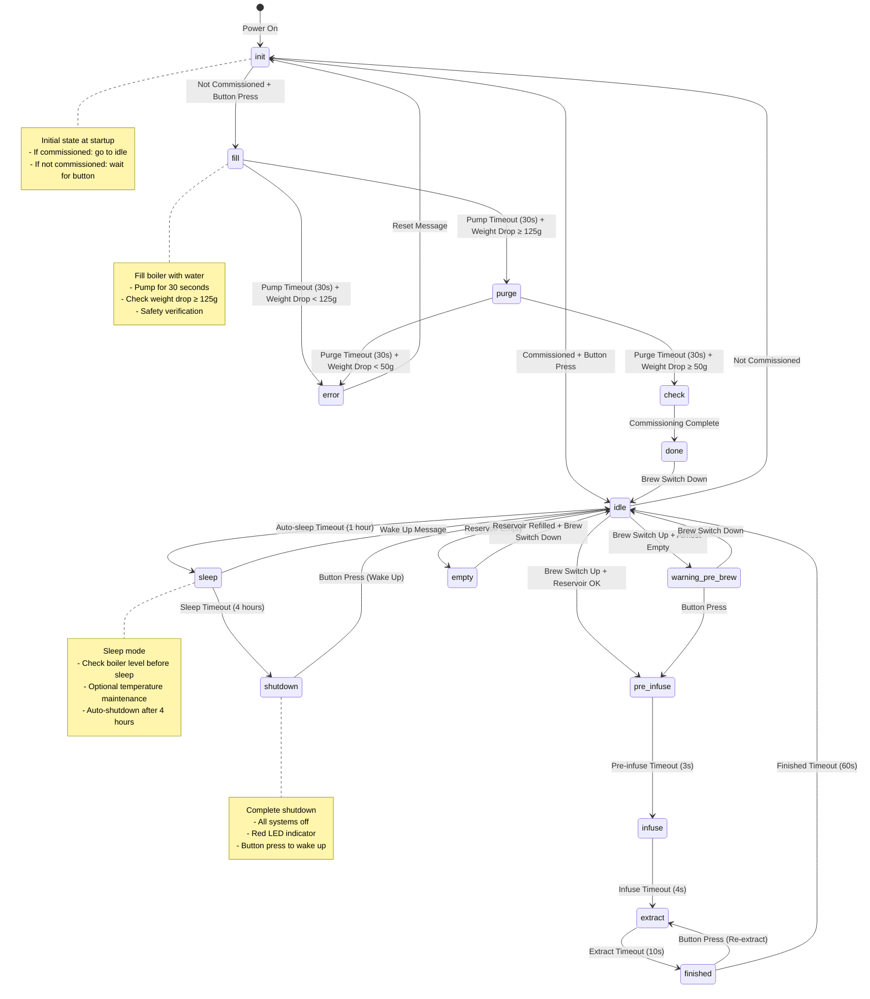
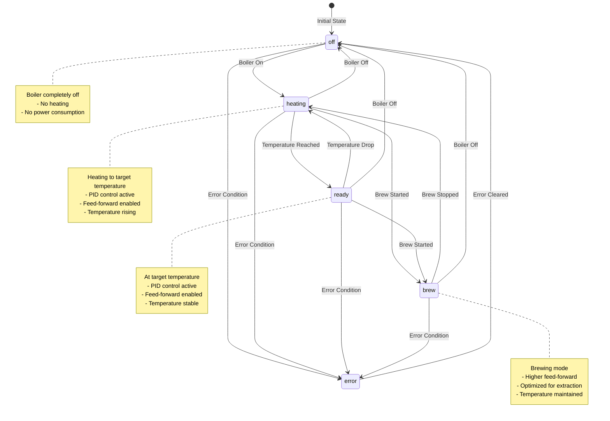

# diyPresso-One State Flow Diagram

This document shows the complete state flow for the diyPresso-One espresso machine, including both the Brew Process and Boiler Control state machines.

## 🎯 Overview

The diyPresso-One uses two main state machines:
- **Brew Process**: Controls the overall machine operation and brewing sequence
- **Boiler Control**: Manages boiler temperature and heating states

## 📊 Brew Process State Machine

### Main States



### State Details

| State | LED Color | Description | Triggers |
|-------|-----------|-------------|----------|
| `init` | BLACK | Initial startup state | Power on |
| `fill` | BLACK | Filling boiler during commissioning | Button press in init |
| `purge` | BLACK | Purging air from boiler | Successful fill |
| `check` | BLACK | Checking boiler temperature | Successful purge |
| `done` | BLACK | Commissioning complete | Temperature stable |
| `idle` | GREEN | Ready to brew | Normal operation |
| `warning_pre_brew` | RED | Low water warning | Almost empty reservoir |
| `pre_infuse` | BLUE | Pre-infusion phase | Start brewing |
| `infuse` | YELLOW | Infusion/soaking phase | Pre-infuse complete |
| `extract` | PURPLE | Extraction phase | Infusion complete |
| `finished` | CYAN | Brewing complete | Extraction complete |
| `sleep` | BLACK | Sleep mode | 1 hour inactivity |
| `shutdown` | RED | Complete shutdown | 4 hours in sleep |
| `empty` | CYAN | Reservoir empty | No water detected |
| `error` | RED | Error state | Various errors |

## 🔥 Boiler Control State Machine

### Boiler States



### Boiler State Details

| State | Description | Feed Forward | PID Control |
|-------|-------------|--------------|-------------|
| `off` | Boiler completely off | 0% | Disabled |
| `heating` | Heating to target | Heat FF | Active |
| `ready` | At target temperature | Ready FF | Active |
| `brew` | Brewing mode | Brew FF | Active |
| `error` | Error state | 0% | Disabled |

## 🔄 State Transitions & Triggers

### Brew Process Triggers

| Trigger | Description | States Affected |
|---------|-------------|-----------------|
| **Button Press** | Dial button pressed | `init` → `fill`, `warning_pre_brew` → `pre_infuse`, `finished` → `extract`, `shutdown` → `idle` |
| **Brew Switch Up** | Switch moved to brew position | `idle` → `pre_infuse`/`warning_pre_brew` |
| **Brew Switch Down** | Switch moved to idle position | `pre_infuse`/`infuse`/`extract` → `idle` |
| **Auto-sleep Timeout** | 1 hour of inactivity | `idle` → `sleep` |
| **Sleep Timeout** | 4 hours in sleep | `sleep` → `shutdown` |
| **Wake Up Message** | Long button press | `sleep` → `idle` |
| **Reservoir Empty** | No water detected | Any state → `empty` |
| **Reservoir Refilled** | Water detected | `empty` → `idle` |
| **Commissioning Complete** | Initial setup done | `check` → `done` |
| **Reset Message** | Error cleared | `error` → `init` |

### Boiler Control Triggers

| Trigger | Description | States Affected |
|---------|-------------|-----------------|
| **Boiler On** | `boilerController.on()` | `off` → `heating` |
| **Boiler Off** | `boilerController.off()` | Any state → `off` |
| **Start Brew** | `boilerController.start_brew()` | `heating`/`ready` → `brew` |
| **Stop Brew** | `boilerController.stop_brew()` | `brew` → `heating` |
| **Temperature Reached** | Within temp window | `heating` → `ready` |
| **Temperature Drop** | Outside temp window | `ready` → `heating` |
| **Error Condition** | Various errors | Any state → `error` |
| **Error Cleared** | Error reset | `error` → `off` |

## 🛡️ Safety Features

### Boiler Level Checking

The system automatically checks and refills the boiler at critical times:

| Check Type | Trigger | Description |
|------------|---------|-------------|
| **Startup Check** | After power-on | Verify boiler level after startup |
| **Pre-sleep Check** | Before entering sleep | Ensure boiler is full before sleep |
| **Post-brew Check** | After brewing | Replenish water lost during brewing |
| **Emergency Check** | Dry boiler detected | Automatic refill when dry boiler detected |

### Safety Timeouts

| Timeout | Duration | Action |
|---------|----------|--------|
| **Auto-sleep** | 1 hour | Enter sleep mode |
| **Shutdown** | 4 hours | Complete system shutdown |
| **Boiler Fill** | 60 seconds | Maximum fill time (safety) |
| **Boiler Fill Test** | 5 seconds | Check cycle duration |

## 🎮 User Interactions

### Button Functions

| Action | Function | States Affected |
|--------|----------|-----------------|
| **Short Press** | Menu navigation, state transitions | Various states |
| **Long Press** | Sleep/Wake toggle | `idle` ↔ `sleep` |
| **Press in Shutdown** | Wake up from shutdown | `shutdown` → `idle` |

### Brew Switch Functions

| Position | Function | States Affected |
|----------|----------|-----------------|
| **UP (Open)** | Start brewing | `idle` → `pre_infuse` |
| **DOWN (Closed)** | Stop brewing, return to idle | Brewing states → `idle` |

## 📈 State Flow Summary

### Normal Operation Flow
```
Power On → Init → Idle → Pre-infuse → Infuse → Extract → Finished → Idle
```

### Sleep Flow
```
Idle → Sleep (1h) → Shutdown (4h) → [Button Press] → Idle
```

### Commissioning Flow
```
Power On → Init → Fill → Purge → Check → Done → Idle
```

### Error Recovery Flow
```
Any State → Error → [Reset] → Init → Idle
```

This state flow ensures safe, reliable operation with automatic safety features and intuitive user interactions.


